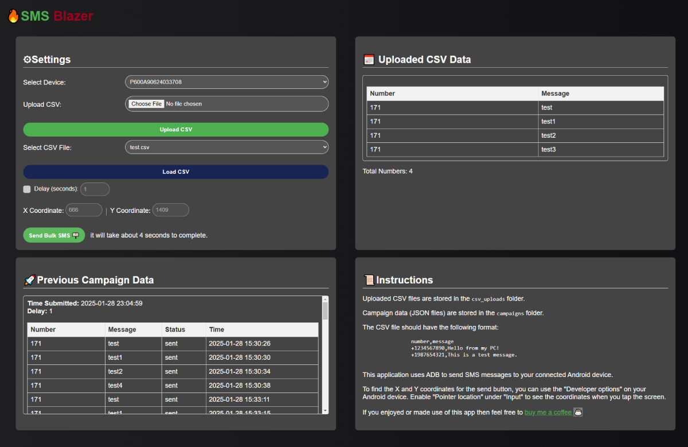

# SMS Blazer - Python SMS ADB Bulk Sender with UI

This is a simple web-based UI for sending SMS messages using Android Debug Bridge (ADB). It allows you to upload a CSV file containing phone numbers and messages, and then sends those messages to the specified Android device.

## Features

-   Select a connected Android device.
-   Upload a CSV file with phone numbers and messages.
-   Set a delay between messages.
-   View the uploaded CSV data.
-   View previous campaign data.
-   Stop the sending process.
-   Input X and Y coordinates for the send button.

## Installation

1.  **Install Python and pip:** Make sure you have Python and pip installed on your system. You can download them from [python.org](https://www.python.org/).
2.  **Install ADB:** Ensure that you have ADB installed and configured on your system. You can download it from the [Android SDK Platform Tools](https://developer.android.com/tools/releases/platform-tools#downloads).
3.  **Clone the repository:** Clone this repository to your local machine.
4.  **Install dependencies:** Navigate to the project directory and run the following command to install the required Python packages:

    ```bash
    pip install -r requirements.txt
    ```
    Also install pure-python-adb
    ```bash
    pip install -U pure-python-adb
    ```
5.  **Install Flask:** Install Flask using npm

    ```bash
    npm install flask
    ```

## Setup

1.  **Enable USB Debugging:** On your Android device, enable USB debugging in the developer options.
2.  **Connect your device:** Connect your Android device to your computer using a USB cable.
3.  **Start ADB server:** Open a terminal or command prompt and run the following command to start the ADB server:

    ```bash
    adb start-server
    ```
4.  **Verify device connection:** Run the following command to verify that your device is connected:

    ```bash
    adb devices
    ```
    You should see your device listed.
5.  **Run the application:** Navigate to the project directory and run the following command to start the Flask application:

    ```bash
    npm run start
    ```
    This will start the Flask development server.
6.  **Access the UI:** Open your web browser and go to `http://0.0.0.0:5000` to access the SMS Texting UI.

## Usage

1.  **Select Device:** Select your connected Android device from the dropdown menu.
2.  **Upload CSV:** Upload a CSV file containing phone numbers in the "number" column and messages in the "message" column.
3.  **Load CSV:** Load the CSV file to view the data.
4.  **Set Delay:** Set the delay in seconds between each message.
5.  **Enter Coordinates:** Input the X and Y coordinates for the send button.
6.  **Send Bulk SMS:** Click the "Send Bulk SMS" button to start sending messages.

!!DO NOT REFRESH THE APP after submitting Bulk SMS Button, It will sometimes re-send the form submission. Working on getting this fixed!!
In order to reload the UI just delete evertything after your localhost:port/

## CSV Format

The CSV file should have the following format:

```csv
number,message
1234567890,Hello from my PC!
1987654321,This is a test message.
```

## Notes

-   The application uses the `ppadb` library to interact with your Android device.
-   The application uses the `adb` command to send SMS messages.
-   The application creates a folder for each campaign and stores the campaign data in a JSON file.
-   The application does not support scheduling messages for a specific time.
-   To find the X and Y coordinates for the send button, you can use the "Developer options" on your Android device. Enable "Pointer location" under "Input" to see the coordinates when you tap the screen.

## Disclaimer

This application is provided as-is, without any warranty. Use it at your own risk.




If you enjoyed or made use of this app then feel free to <a href="https://buymeacoffee.com/joshuawilliams">buy me a coffee ☕</a>
